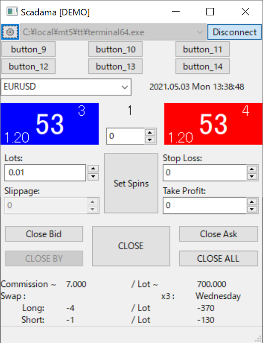

# Scadama

Scadama (スキャ魂) is a scalping oriented trading tool for MetaTrader 5.

- main.py
  - main().
- ui.py
  - Generated UI code by wxGlade.
- impl.py
  - Implementation of UI, overriding ui.py.

Takuto Nanjo (南條 拓斗)
